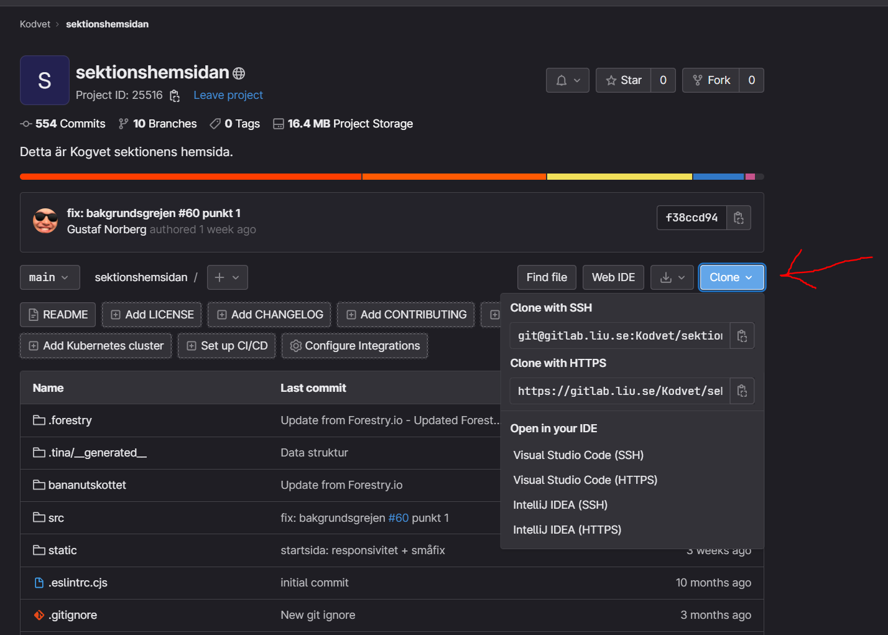

# Sektionshemsidan
Välkommen till kodvets hemmabryggda sektionshemsida för kogvet.

För att börja koda så behövs några saker installeras.

## Förutsättningar

* git
* node

Git vet ni nog vad det är om ni läser detta. Ni behöver instalera det på datorn för att kunna klona repot.

Node är en "runtime" för javascript som kan köras på en dator. Det innebär att man kan använda javascript bibliotek som inte bara lägger till funktionalitet på en hemsidan genom att inkludera extra kod, utan istället kan användas för att bygga hemsidorna.

Dem kommer upp som högsta resultat på google och båda har stora fina ladda ner knappar.

## Kom igång

Efter att ni har installerat det så är det bara några steg till att börja hacka.

1. Klona repot
    
    Jag rekommenderar att klona med ssh. Det gör så att ni inte behöver skriva användarnamn+lösen för varje push. [Guide](https://docs.gitlab.com/ee/user/ssh.html#generate-an-ssh-key-pair). tl;dr:
    1. kör `ssh-keygen -t ed25519 -C "<comment>"` i en terminal.
    2. Öppna den genererade filen och lägg till innehållet till er gitlab profil i preferences.

2. Öppna mappen i VS Code, ta fram en terminal (`ctrl + j` om den inte redan syns kör kommandon: `npm install`-> `npm run dev`
    "npm install" installerar alla javascript bibliotek som behövs (vilket är över 500MB BTW). "npm run dev" startar utvecklingsmiljön som visar hur hemsidan kommer se ut efter att all kod kompileras.

Good to go!

Ett vanligt strul är att man skapar en mapp som heter "sektionshemsidan", sen klonar man till den vilken skapar en till mapp som heter "sektionshemsidan" där projektet hamnar. Öppnar man den yttre mappen i VS Code och dess terminal så kommer npm-kommandona inte fatta ett skit eftersom node-projektet är _inuti_ den inre mappen. Då kan ni antingen applicera lite 729G46 kunskaper för att hamna i rätt mapp, eller bara flytta ut den inre mappen och öppna VS Code i den.
